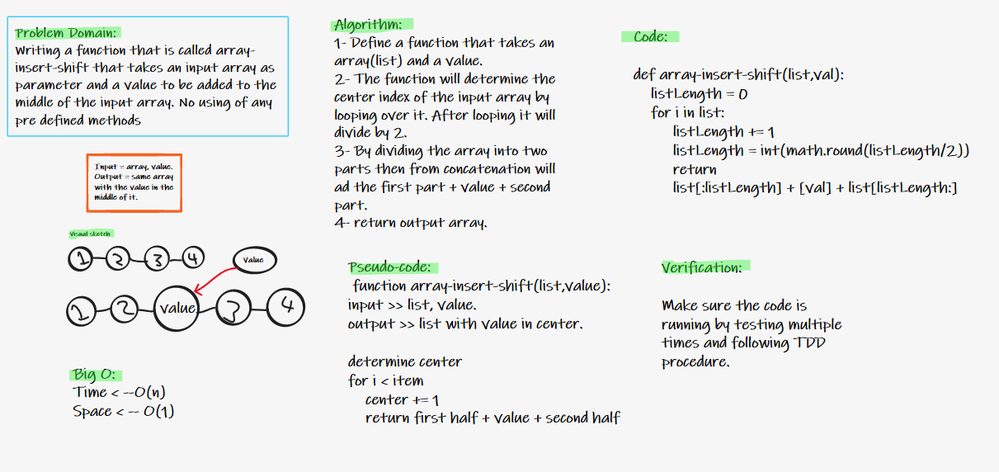

# Array-Insert-Shift
To write an algorthim to explain code procedure and steps in order to solve the problem of adding a value to the middle of a given list without using any built-in functions or methods.

## Whiteboard Process

## Approach & Efficiency

By analyzing what the problem is, I figure out the solution by getting the center of the input array through looping over it to count how many items are in the loop and dividing the final value by 2. Then dividing the list into two parts using the center index, adding the value in between using concatenation and finally returning the output array.

