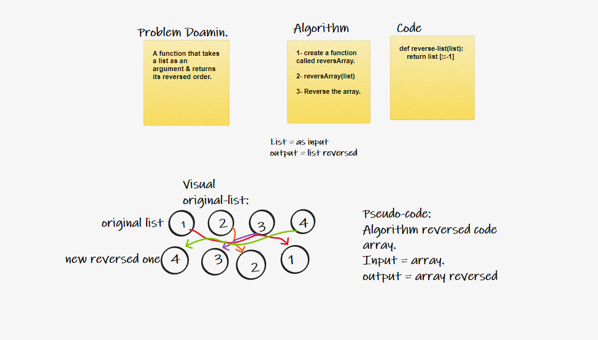

# Reverse an Array.
## To utilize a logical way by thinking of an algorithm to reverse an existed array without using built in functions.

# White Board Image.

## By analyzing the problem doamin I started searching about Python array methods to come up with a solution, so to reverse an array we simply use the [::-1] to reverse all the index orders. Simple and efficient.