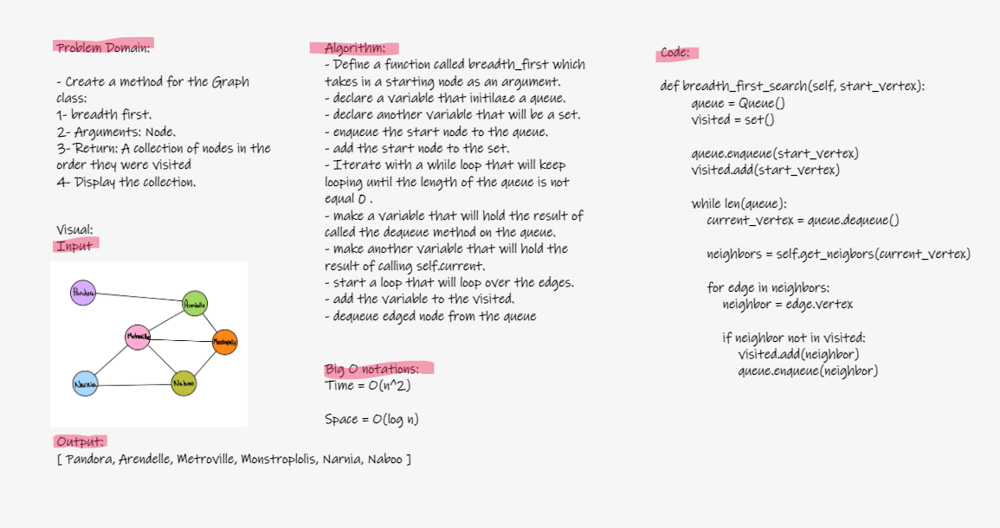

# Challenge Summary: ## *Graphs Breadth First*


- Write the following method for the Graph class:
```
breadth first
Arguments: Node
Return: A collection of nodes in the order they were visited.
Display the collection
```
## Whiteboard illustration.



## Approach & Efficiency

- Approach:
Whiteboarding > coding and testing.

- Big O:

Time = O(n^2)

Space = O(log n)

## Solution

Code [here](graph_breadth_first_search.py)