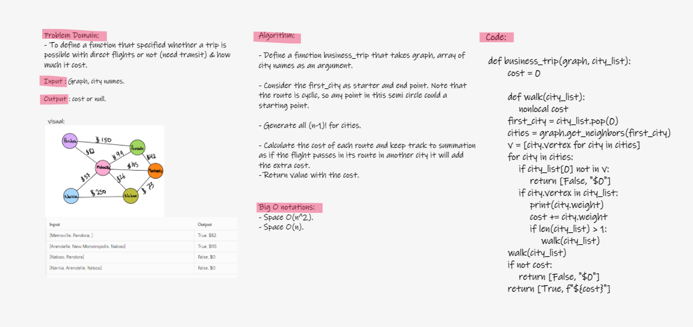

# Challenge Summary

### Graph Business Trip

- Write a function called business trip
```
Arguments: graph, array of city names
Return: cost or null
Determine whether the trip is possible with direct flights, and how much it would cost.
```
## Whiteboard Process



## Approach & Efficiency

- Approach:
Whiteboarding > coding and testing.

- Big O:

Time = O(n^2)

Space = O(n)

## Solution

Code [here](graph_business_trip.py)