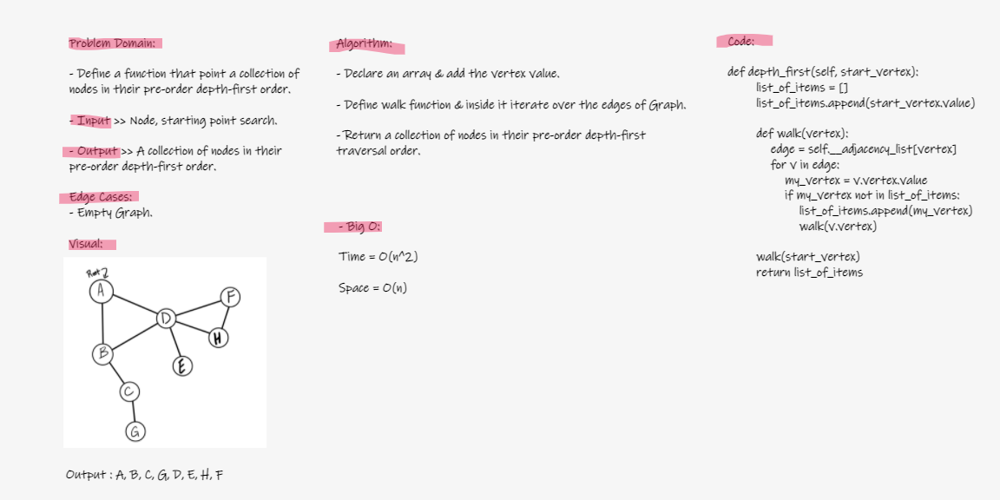

# Challenge Summary

### Graph Depth First

- Write a method inside the Graph Class called depth_first that takes a self and vertex as a parameter and return a collection of vertex in their pre-order depth-first traversal order

## Whiteboard Process

## Approach & Efficiency

- Approach:
Whiteboarding > coding and testing.

- Big O:

Time = O(n^2)

Space = O(n)

## Solution

Code [here](graph_business_trip.py)