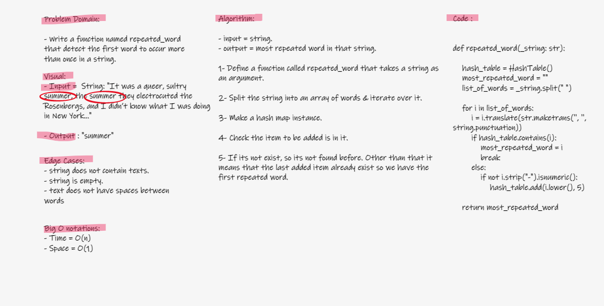

# Challenge 31

### Hash-Map Repeated Words

- Write a function called repeated word that finds the first word to occur more than once in a string
-Arguments: string
-Return: string

## Whiteboard Process

## Approach & Efficiency

- Approach:
Understanding Psuedo Code > Whiteboarding > coding and testing.

- Big O:

Time = O(n)

Space = O(1)

## Solution

Code [here](hashmap_repeated_word.py)
