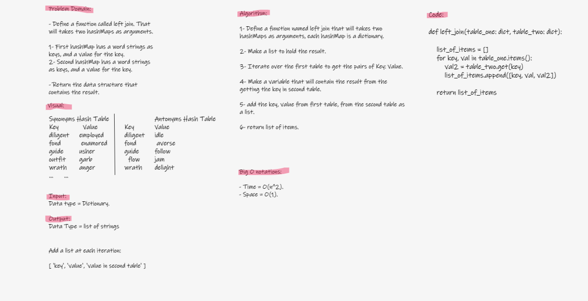

# Hashmap Left Join

* Write a function called left join
- Arguments: two hash maps
- Return: The returned data structure that holds the results.

## Whiteboard Process

## Approach & Efficiency

Approach:

Whiteboarding > Writing tests > Implemeting code and fixing as needed

Big O:

Time = O(n^2)

Space = O(1)

## Solution

[Code](hashmap_left_join.py)