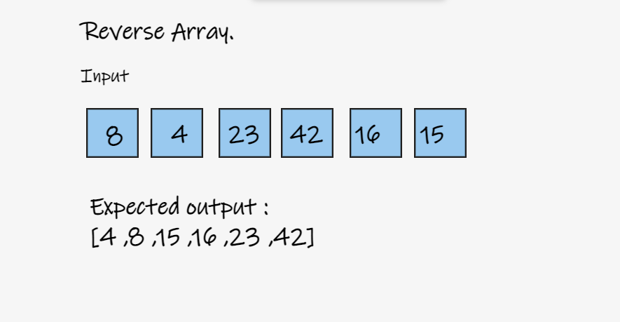
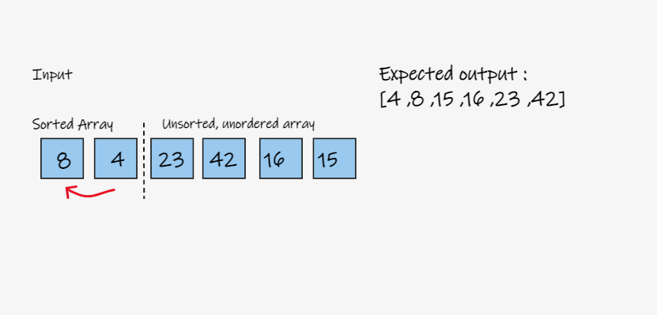
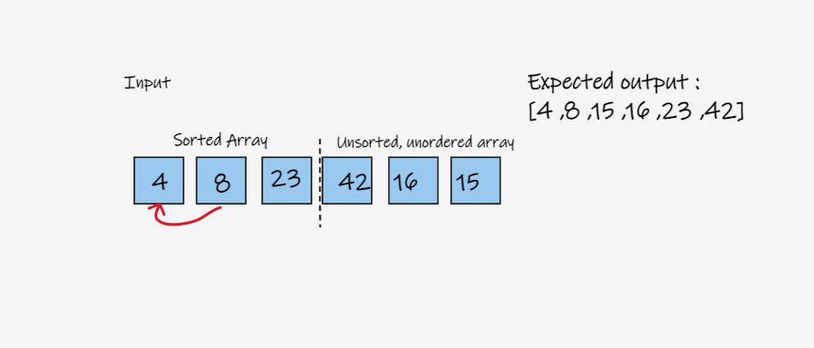
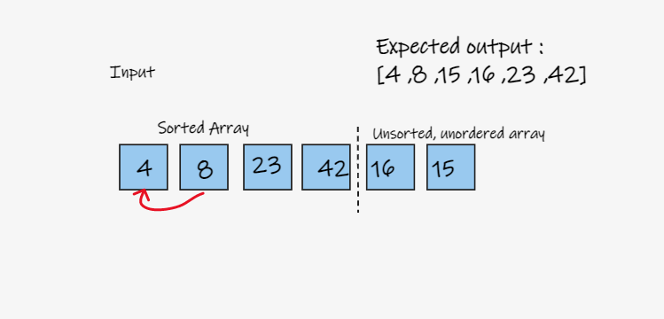
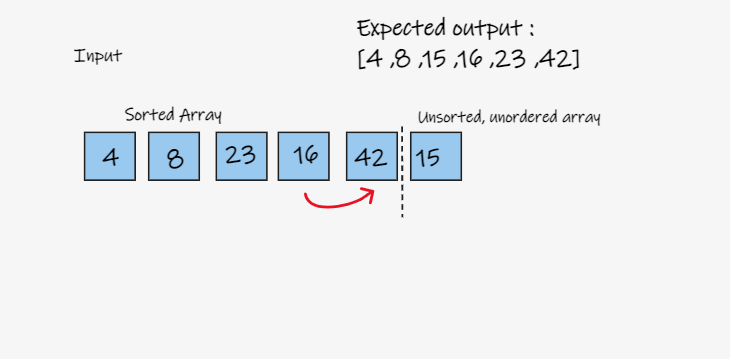
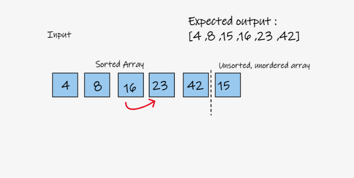
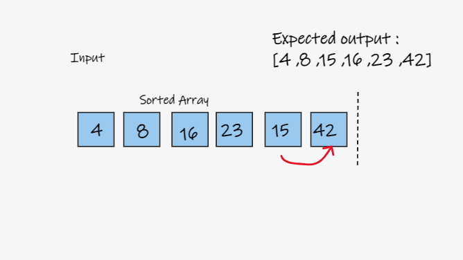
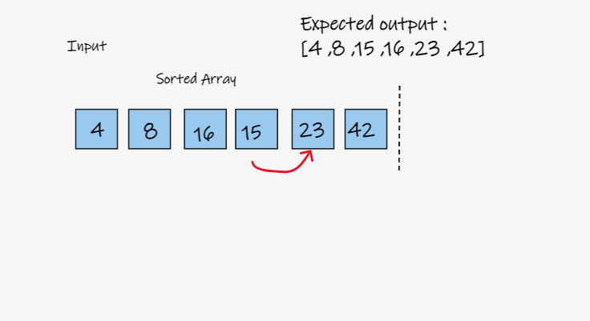
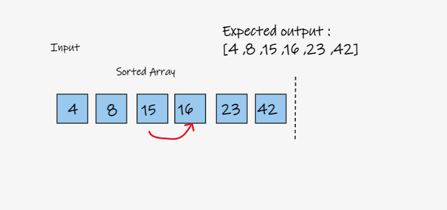
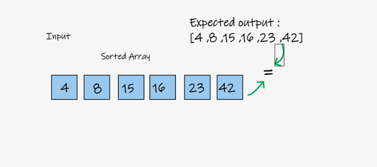

# Insertion Sort Blog.


- ### Reverse this array using insertion sort:

```
python
[8,4,23,42,16,15]
```



### Steps:

### At first, we split the array into 2 partitions, the sorted and unsorted arrays and then we compare the first element with the second, if the second element is less than the first element, we replace the first element with the second element, otherwise we are going to assume that its bigger and so move on.



The third array element is bigger as we notice than its previos element so we will ignore that and move on.



Same for the next element, its already bigger.



Now the next element on the list is less than its previous element, so we are going to replace that element with its previous.



We still have the same thing, the previous element is bigger so we will justs replace that aswell



Now thats sorted, we will move on to the next element, but it also appears thats it less than its previous element so we will repeat the same steps








Finally, we got a sorted array that matches our expected outcome;




### Big O

Time = O(n^2)

Space = O(1)