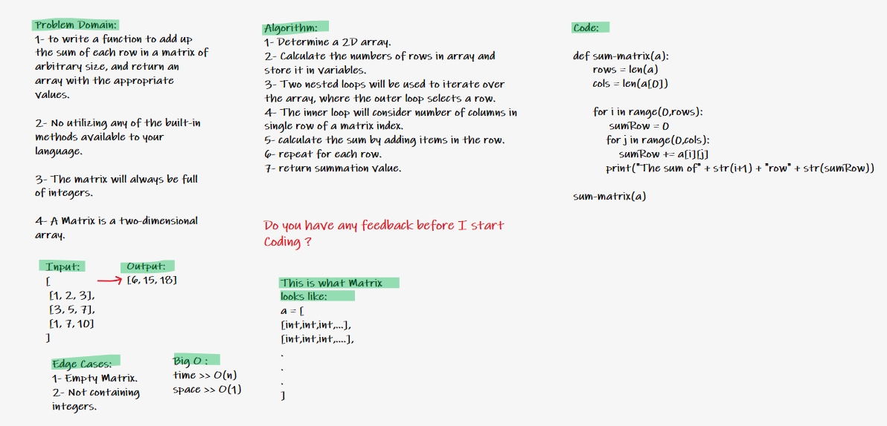

# Calculate the summation of multiple rows inside a matrix.
## To utilize a logical way by thinking of an algorithm to determine the sum of items in a row of a 2D array (Matrix).

# White Board Image.

## By analyzing the problem doamin I started thinking about looping each row and column so I needed nested loops inside each othe and adding the integers together to return the final sum.