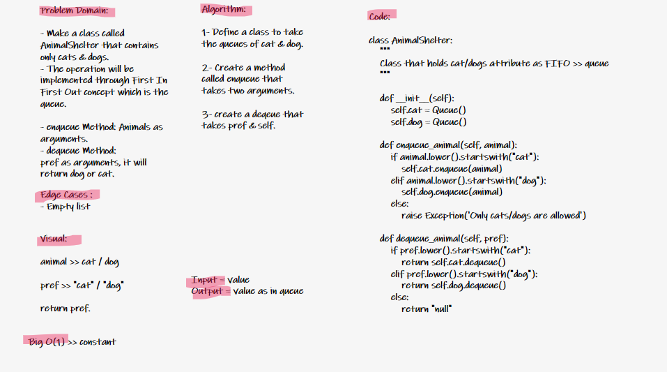

# Challenge Summary

Create a class called AnimalShelter that contains only dogs and cats.
The shelter operates using a FIFO concept.

## Whiteboard Process

## Approach & Efficiency

The approach used here is to create classes and methods

Big O = O(1)

