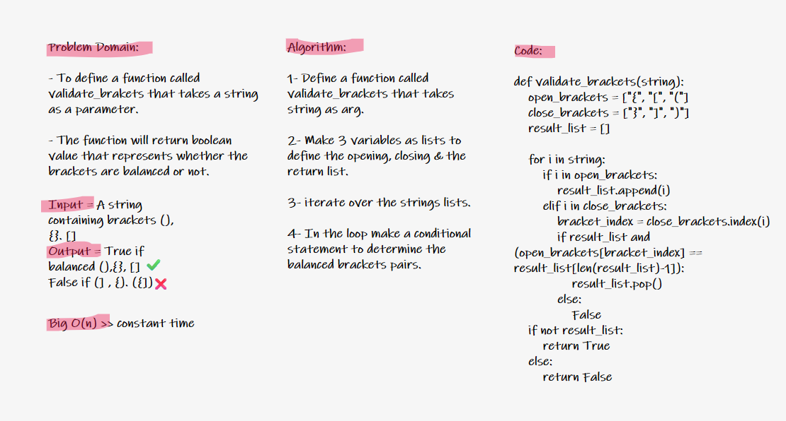

# Challenge 13: Multi-bracket Validation.

Write a function called validate brackets
Arguments: string
Return: boolean
    representing whether or not the brackets in the string are balanced

## Whiteboard Sketching:

## Approach & Efficiency

Big O = O(n) >> constant time
