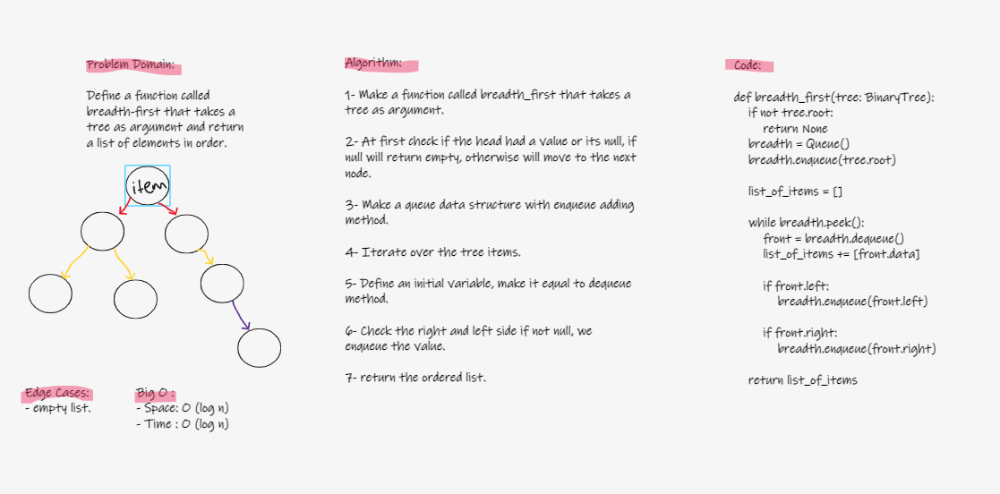

# Challenge Summary
Define a function called breadth first which traverses a tree following breadth-first apporach and returns a list of all values in the tree in order that they were encountered.

## Whiteboard Process


## Approach & Efficiency

Approach: White Boarding > TDD > Fixing Code

Efficiency:
    Time: O(log n)
    Space: O(log n)

## Solution

```
def breadth_first(tree: BinaryTree):
        if not tree.root:
            return None
        breadth = Queue()
        breadth.enqueue(tree.root)

        list_of_items = []

        while breadth.peek():
            front = breadth.dequeue()
            list_of_items += [front.data]

            if front.left:
                breadth.enqueue(front.left)

            if front.right:
                breadth.enqueue(front.right)

        return list_of_items
```