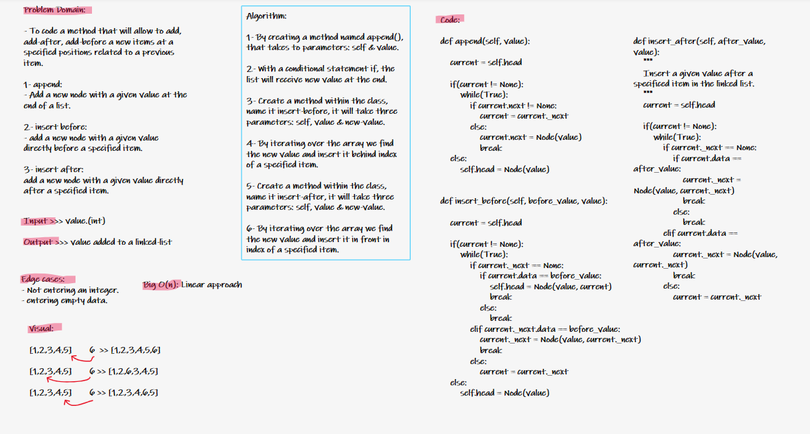

# code-challenge 7
## Return the node’s value that is k places from the tail of the linked list.
 

## Efficiency:
## Big O(n) : linear approach.

 

## Tasks Checklist:
- ### [x] = completed.

- ### [x] Where k is greater than the length of the linked list
- ### [x] Where k and the length of the list are the same
- ### [x] Where k is not a positive integer
- ### [x] Where the linked list is of a size 1
- ### [x] “Happy Path” where k is not at the end, but somewhere in the middle of the linked list

# code-challenge 6
# Single Linked List - Insertions.

### Create Node class and Linked list class to add new node at the end  and insert new item after or before a specific node

## White Board:

 

## Challenge:
### The challenge is to make Linked list and start adding nodes that has a value and points to the next node and last node points to None.

## Approach & Efficiency
### The Efficiency of Big O is O(n) linear.

## API
## We have 3 methods:
- ### **append method** : that used to add new node at the end  to the linked lists
- ### **insert before  method**: that used to to add new node before a node
- ### **str method**: to give a presenting way to the user when he prints the object after adding values for example:
- #### insert after  method: that used to to add new node after a node

## Task lists
- ### [x] = completed.
- ### [x] Can successfully add a node to the end of the linked list.

- ### [x] Can successfully add multiple nodes to the end of a linked list.

- ### [x] Can successfully insert a node before a node located i the middle of a linked list.
- ### [x] Can successfully insert a node before the first node of a linked list.
- ### [x] Can successfully insert after a node in the middle of the linked list.
- ### [x] Can successfully insert a node after the last node of the linked list.
 

# code-challenge 5
# Singly Linked List

### Create Node class and Linked list class to add new node that has a value and a reference to next node.
 

## Challenge
## its a challenge to make Linked list and start adding nodes that has a value and points to the next node and last node points to None

## Approach & Efficiency
## The Efficiency of Big O is O(n) linear.

## API
## We have 3 methods:
- ### **append method** : that used to add new node to the linked lists
- ### **search method**: that used to search for specific values in the linked list
- ### **str method**: to give a presenting way to the user when he prints the object after adding values for example
- ### **counter method** : to count how many times we added a value

## Task lists
- ### [x] = completed.
- ### [x] Can successfully instantiate an empty linked list

- ### [x] Can properly insert into the linked list

- ### [x] The head property will properly point to the first node in the linked list
- ### [x] Can properly insert multiple nodes into the linked list
- ### [x] Will return true when finding a value within the linked list that exists
- ### [x] Will return false when searching for a value in the linked list that does not exist
- ### [x] Can properly return a collection of all the values that exist in the linked list

