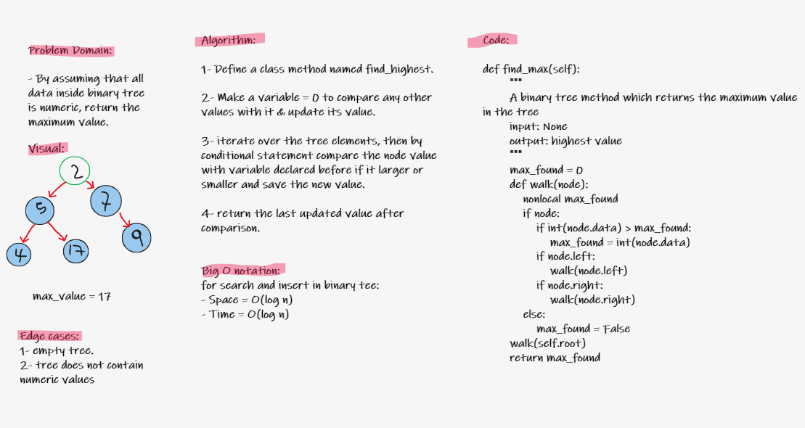

# Code Challenge 16: Tree- max
## Write a binary tree class method which finds the highest value in the tree and return it.
# Whiteboard proccess:

# Approach & Efficiency
- ## Approach: White Boarding > TDD > Fixing Code.
- ## Efficiency: Time: O(log n) Space: O(log n).
# Solution:
```
def find_max(self):
        """
         A binary tree method which returns the maximun value in the tree
        input: Binary Tree
        output: highest value
        """
        max_found = 0
        def walk(node):
            nonlocal max_found
            if node:
                if int(node.data) > max_found:
                    max_found = int(node.data)
                if node.left:
                    walk(node.left)
                if node.right:
                    walk(node.right)
            else:
                max_found = False
        walk(self.root)
        return max_found
```
<br>


# Data Structure : Trees

A tree data structure is which each node has at most two children, which are referred to as the left child and the right child. A recursive definition using just set theory notions is that a (non-empty) binary tree is a tuple (L, S, R), where L and R are binary trees or the empty set and S is a singleton set containing the root.

## Challenge
Creating a binary tree class with its methods

## Approach & Efficiency


- Time O(log n)
- Space O(log h)

## API


    bfs(self)
    """
    A binary tree method which returns a list of items that it contains

    input: None

    output: tree items
    """

    pre_order(self)
    """
    A binary tree method which returns a list of items that it contains

    input: None

    output: tree items

    sub method : walk () to make the recursion staff
    """


    in_order(self)
    """
    function to in order the list using Trees
    """

    post_order(self)
    """
    A binary tree method which returns a list of items in post order

    input: None

    output: tree items
    """

    Binary Search Tree Class Specific Methods:

    add(self,value)
    """
    a class method that adds a value to the tree

    input: value

    output: none
    """

    contains(self,value)
    """
    a class method that detects if a value exists within the tree or not.

    input: value

    output: true or false
    """
